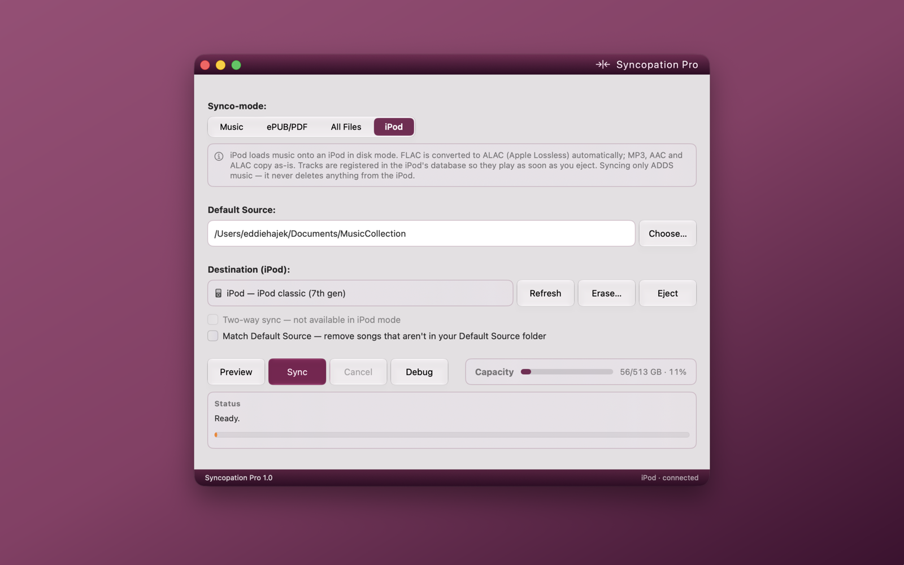
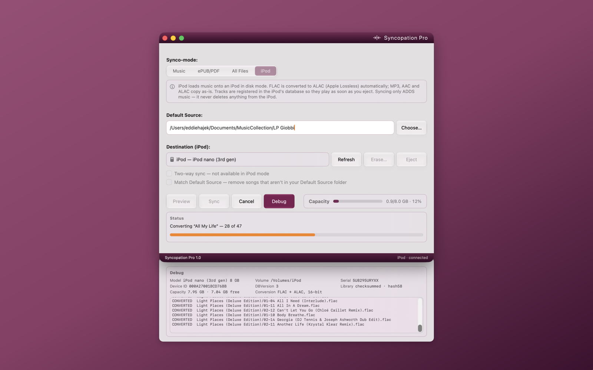

# Syncopation Pro

**Load music onto classic iPods — no iTunes, no Swinsian, no cloud.**

Syncopation Pro is a native macOS app that syncs music straight onto iPods in
disk mode. Plug in an iPod classic or nano, pick a folder, hit Sync — tracks
appear on the device, with album art, ready to play the moment you eject.

> This repository is the **support and documentation home** for Syncopation
> Pro. The application itself is proprietary and its source code is not
> published here. For the free, open-source edition, see the
> [Syncopation Community Edition](https://github.com/ehajek/Syncopation-Community-Edition).

## What it does

- **Synco-Mode** — one app, four modes: Music, ePUB/PDF, All Files, and iPod.
- **iPod mode** — detects any iPod in disk mode, identifies the exact model
  from a built-in table of every iPod ever made, and writes the device's
  native database directly (including the checksummed databases that
  classics and nanos require). Tracks play immediately after eject.
- **FLAC → ALAC conversion** — automatic, using macOS's built-in encoder.
  Output is 16-bit / 44.1–48 kHz, exactly what the devices were built to
  play; hi-res sources are downsampled correctly.
- **Album artwork** — covers are extracted from your files, rendered into
  the device's native thumbnail formats, and shown on the iPod.
- **Interrupted syncs don't start over** — the iPod's library is saved as the
  transfer runs, not once at the end. Knock the cable out an hour into a big
  sync and you keep everything transferred so far as a working, playable
  library; sync again and it carries on where it stopped.
- **Reclaims wasted space** — removing a track from an iPod normally leaves
  its audio file behind forever, invisible and unplayable. Syncopation finds
  these strays and clears them automatically. On a real 160 GB classic that
  recovered **33.8 GB** — a fifth of the drive.
- **Keeps your library tidy** — tracks already on the iPod are recognized and
  never duplicated, even ones another app put there, and missing album art is
  filled in as you sync.
- **Safe by design** — existing music and playlists are always preserved,
  every database write keeps a backup on the device, and syncing only adds
  unless you explicitly ask it to match your source folder.
- **Podcasts and audiobooks — Synco-pod** — filed as what they are: they
  resume where you stopped, stay out of shuffle, and are marked unplayed.
  DRM-free files only; Apple Books and Audible purchases are copy-protected.
- **Accessibility** — Liquid Glass on macOS 26 and up; window transparency
  and a System, Light, or Dark appearance on every supported macOS, Ventura
  included — each switchable. A sound in your own alert tone when a sync
  finishes.
- **Everything the free version does** — one-way and two-way folder/SD-card
  sync with conflict handling, previews, and per-mode file filtering.

## Pro vs Community Edition

Same engine, same four modes, same care with the iPod's database. Pro adds
the things that take a library from *copied* to *kept*. Both editions are
at 1.1. What each version repaired and added, release by release:
[RELEASES.md](RELEASES.md).

| | **Pro** | **CE** |
|---|:---:|:---:|
| Four Synco-modes — Music, ePUB/PDF, All Files, iPod | ✓ | ✓ |
| Native iPod database engine — hash58 checksums, tracks play on eject | ✓ | ✓ |
| FLAC → Apple Lossless, 16-bit, in-process | ✓ | ✓ |
| iPod identification | Exact model — "iPod classic (7th gen)" | Family only — "iPod classic" |
| Album artwork on the iPod | ✓ | — |
| Skips tracks already on the device | By tags — even ones another app put there | By file |
| Interrupted sync | Checkpointed — carries on where it stopped | Stops cleanly — tidies up on the next run |
| Reclaims stray files other software left behind | ✓ | — |
| Two-way sync for folders and SD cards | ✓ | — |
| Match Default Source — device mirrors the folder, deletions included | ✓ | — |
| Preview, Erase, Eject, free-space check | ✓ | ✓ |
| Debug drawer — device facts and the per-file log | ✓ | ✓ |
| Accessibility | Liquid Glass (macOS 26 and up); transparency, System, Light, Dark mode on every supported macOS, Ventura included — each switchable | System, Light, Dark mode — flat |
| Distribution | Mac App Store — sandboxed, notarized, reviewed | GitHub — clone it, build it |
| Price | $19.99 once; $24.99 from January 1, 2027 | Free, GPL v3 |
| Conversion runs ahead of the copy — a faster first sync | ✓ | ✓ |
| The Mac stays awake while a sync runs | ✓ | ✓ |
| Space check prices hi-res tracks at their converted size | ✓ | ✓ |
| Synco-pod — podcasts and audiobooks filed as such: resume position, kept out of shuffle, unplayed flag | ✓ | ✓ |
| A sound when a sync finishes, in your own alert tone | ✓ | ✓ |
| Match Default Source removes items — episodes and books included, not just songs | ✓ | — |

## Requirements

- macOS 13 (Ventura) or later — Intel or Apple Silicon. On macOS 26 and later
  the app uses the Liquid Glass appearance; on earlier systems it falls back
  to standard native controls automatically. Window transparency and the
  System / Light / Dark appearance work on every supported version.
- An iPod in disk mode: iPod classic (all generations), iPod nano
  (through 4th gen), iPod video, mini, or photo. (iPod touch and iPhone use a
  different sync system and are not supported, nor is the iPod shuffle.)

## Getting your iPod ready

Syncopation talks to the iPod directly, so the one-time setup is about telling
iTunes — or Finder, which handles iPods on modern macOS — to stand down.
Connect the iPod, open its device page (Finder's sidebar on macOS Catalina and
later, iTunes everywhere else), and set it up like this:

1. **Turn OFF "Automatically sync when this iPod is connected."**
2. **Turn ON "Enable disk use" and "Manually manage music and videos."**
   Disk mode is how Syncopation sees the device at all.
3. **Uncheck "Convert higher bit rate songs to AAC."** Syncopation handles
   conversion itself, matched to what the device actually plays.
4. **Uncheck every sync category — Music, Photos, Podcasts, all of them.**
   Nothing should be left for iTunes or Finder to manage.
5. Click Apply, then eject. From here on, Syncopation does the syncing.

One habit worth keeping: **step away from the iPod in Finder before you
eject** — close any windows browsing its files, and click off its device
configuration page. Either one can hold the device busy, and the eject —
from Syncopation or anywhere else — fails with "disk in use" until Finder
lets go.

> [!WARNING]
> **Pick one librarian.** Moving an iPod back and forth between
> iTunes/Apple Music/Finder syncing and Syncopation can scramble the music
> library on the device — each program rewrites the iPod's database in its
> own image. Nothing physical is ever at risk: the worst case is erasing the
> device's music and syncing it again. But save yourself the round trip —
> once an iPod lives with Syncopation, let it.

## Sync speed

Two things set the pace of a sync: how fast the iPod can take files, and —
for FLAC — how fast the Mac can convert them. **The older either one is, the
slower it goes.**

- **What's inside the iPod.** Most click-wheel iPods — mini, photo, video,
  and every classic — shipped with a small spinning hard drive, and writing
  thousands of files to one is slow work. An iPod whose drive has been
  swapped for flash storage (an iFlash board with SD or CF cards, for
  example) takes music markedly faster; the nano is flash from the factory.
- **The cable.** These devices are USB 2.0 at best, and the earliest models
  are slower still. On a plain copy, a modern Mac spends most of the sync
  waiting on the iPod.

**FLAC libraries take the longest.** An MP3 or M4A is simply copied; a FLAC
track has to be decoded and re-encoded to Apple Lossless first. That
conversion runs on the Mac, so **the older the Mac, the slower the
conversion** — an Intel machine works through a library far more slowly than
Apple Silicon does. The Mac keeps a few finished tracks ready ahead of the
transfer, so whichever side is slower sets the pace: an old hard-drive iPod
can't absorb converted tracks as fast as a modern Mac produces them, and an
old Mac can't convert them as fast as a flash-modded iPod can take them.
Either way, a first sync of a large FLAC collection can run for hours.
Leave it plugged in: the transfer checkpoints as it runs, so an interruption
costs nothing already copied, and the next sync carries on from there.

## Support

- **Questions and bug reports:** [open an issue](../../issues) in this
  repository.
- **What changed in each version:** [RELEASES.md](RELEASES.md).
- **How it works under the hood:**
  [docs/TECHNICAL.md](docs/TECHNICAL.md) — the full technical reference for
  the iPod support: device detection, the iTunesDB format, checksums, and
  what these devices really play.

## Status

**Available on the Mac App Store** — version 1.1, released August 20, 2026.

Working today on real hardware — an iPod classic (7th gen) and an iPod nano
(3rd gen): device identification, FLAC → ALAC conversion, writing the iPod's
native checksummed database, album artwork, checkpointed transfers that
survive a disconnect, and automatic cleanup of files other software left
stranded on the device.

## Pricing

**$19.99, once,** through December 31, 2026. From January 1, 2027 the price
is **$24.99**. Either way, every 1.x update is included in that sentence —
there is no subscription.

---

Copyright © 2026 Eddie Hajek. All rights reserved.
Syncopation Pro is proprietary software. iPod is a trademark of Apple Inc.;
this product is not affiliated with or endorsed by Apple.
