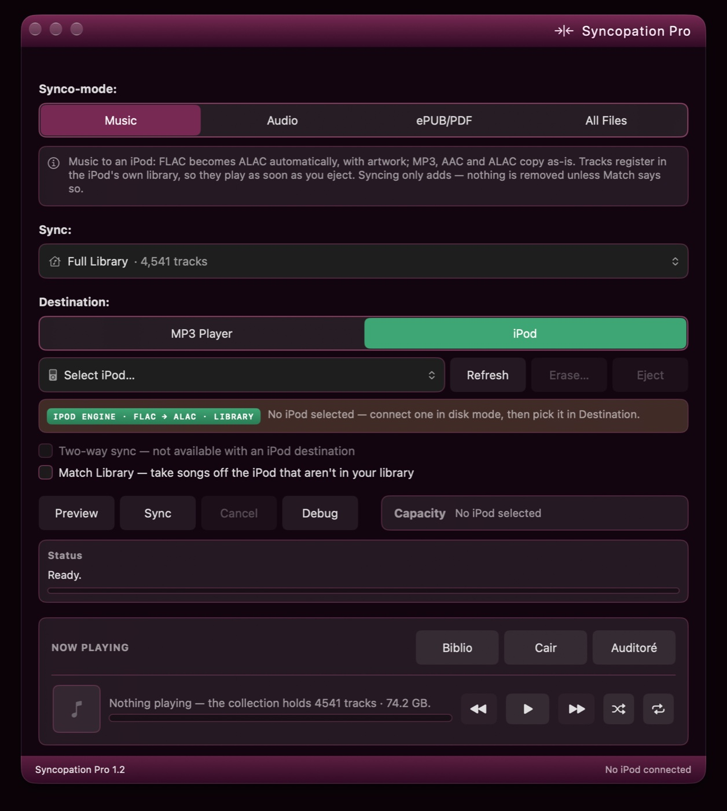
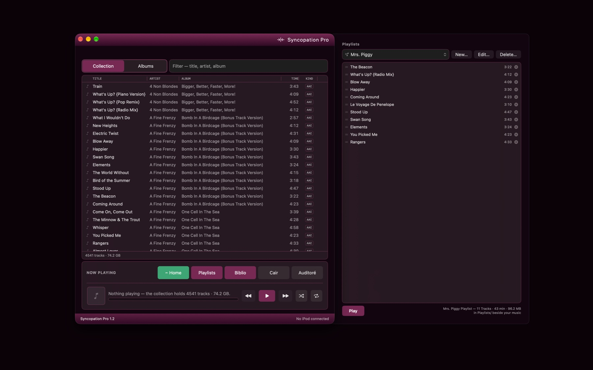
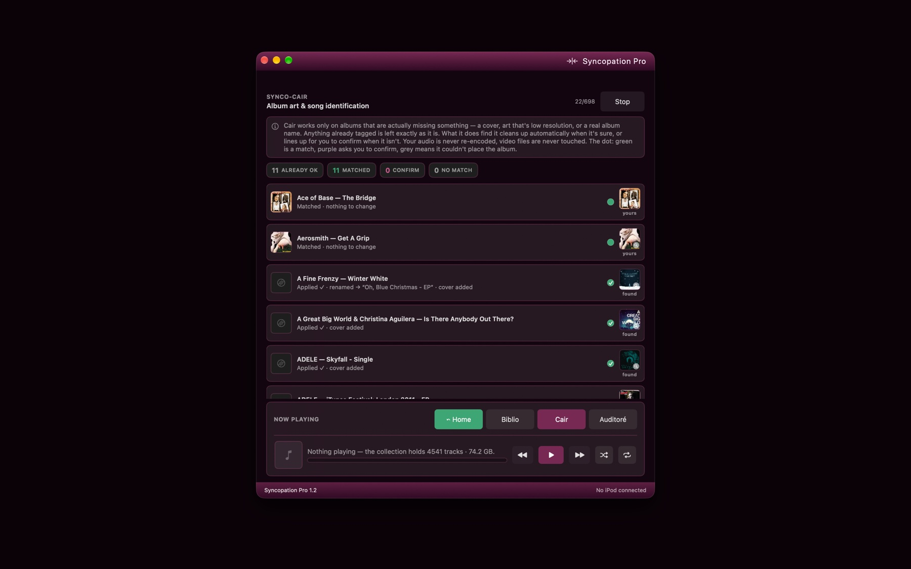
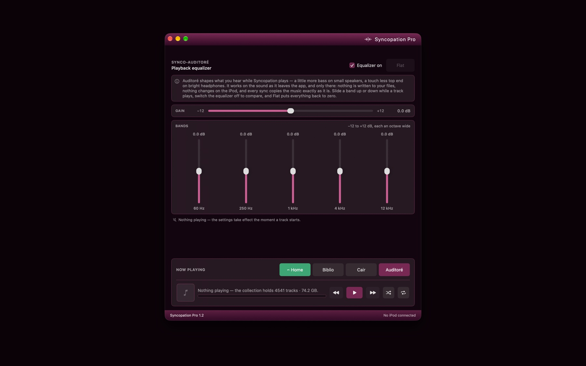

# Syncopation Pro

**Load music onto classic iPods — no iTunes, no cloud.**

Syncopation Pro is a native macOS app that syncs music straight onto iPods in
disk mode — and, from 1.2, keeps the library itself: a shelf, a wall of
covers, playlists, playback, an equalizer, and album art and names put right.
Plug in an iPod classic or nano, pick a folder or a playlist, hit Sync —
tracks appear on the device, with album art, ready to play the moment you
eject.

> This repository is the **support and documentation home** for Syncopation
> Pro. The application itself is proprietary and its source code is not
> published here. For the free, open-source edition, see the
> [Syncopation Community Edition](https://github.com/ehajek/Syncopation-Community-Edition).

## What it does

- **Synco-Mode** — one app, four modes: Music, ePUB/PDF, All Files, and iPod.
- **iPod mode** — detects any iPod in disk mode, identifies the exact model
  from a built-in table of every iPod ever made, and writes the device's
  native database directly (including the checksummed databases that
  classics and nanos require). Tracks play immediately after eject.
- **One playlist or all of it** — the Sync control offers the full library
  or any one playlist; whichever you pick is what lands on the iPod, and
  Match mirrors the same choice.
- **FLAC → ALAC conversion** — automatic, using macOS's built-in encoder.
  Output is 16-bit / 44.1–48 kHz, exactly what the devices were built to
  play; hi-res sources are downsampled correctly.
- **Album artwork** — covers are extracted from your files, rendered into
  the device's native thumbnail formats, and shown on the iPod.
- **Podcasts and audiobooks — Synco-pod** — filed as what they are:
  audiobooks under the iPod's Audiobooks menu, podcasts under Podcasts. They
  resume where you stopped, stay out of shuffle, and are marked unplayed.
  Filing into the menus works on 2007-and-later models (iPod classic, iPod
  nano 3rd generation on); earlier iPods file everything under Music — the
  same result Apple's own current tools produce for those devices. DRM-free
  files only; Apple Books and Audible purchases are copy-protected.
- **Interrupted syncs don't start over** — the iPod's library is saved as the
  transfer runs, not once at the end. Knock the cable out an hour into a big
  sync and you keep everything transferred so far as a working, playable
  library; sync again and it carries on where it stopped.
- **Reclaims wasted space** — removing a track from an iPod normally leaves
  its audio file behind forever, invisible and unplayable. Syncopation finds
  these strays and clears them automatically. On a real 160 GB classic that
  recovered **33.8 GB** — a fifth of the drive.
- **Keeps your library tidy** — tracks already on the iPod are recognized and
  never duplicated, even ones another app put there, and missing album art is
  filled in as you sync.
- **Safe by design** — existing music and playlists are always preserved,
  every database write keeps a backup on the device, and syncing only adds
  unless you explicitly ask it to match your source.
- **Accessibility** — Liquid Glass on macOS 26 and up; window transparency
  and a System, Light, or Dark appearance on every supported macOS, Ventura
  included — each switchable. A sound in your own alert tone when a sync
  finishes.
- **Everything the free version does** — one-way and two-way folder/SD-card
  sync with conflict handling, previews, and per-mode file filtering.

## The library, in one window — new in 1.2

Once an app can see a collection rather than merely copy it, considerably
more becomes possible — three engines' worth. Three doors sit along the
bottom of the window: Biblio, Cair, Auditoré.

### Synco-biblio

The library as a shelf and as a wall of covers; an album slides out to its
tracks. Playlists you build and reorder, sent to the iPod one at a time or
all together. Music dropped in is copied into the library, loose tracks
filed by their tags. Playback with a Now Playing card, and a chip that stays
out of the way. The Mac's own Now Playing follows along — track, cover and
position in Control Center and the menu bar — and the keyboard's media keys
and the buttons on your headphones play, pause, skip and scrub it.

### Synco-cair

Album art and album names, put right. It reads what is already there first
and leaves complete albums alone; whatever is missing a cover, carrying a
thumbnail, or wearing the wrong name is looked up across the free music
databases. The sure ones fix themselves. The rest line up for one look and
one click. Audio is never re-encoded. Video files are never touched.

### Synco-auditoré

A five-band equalizer and gain on playback — live while a track plays,
remembered between launches. It works on the sound as it leaves the app,
and only there: nothing is written to your files, nothing changes on the
iPod, and every sync copies the music exactly as it is.

**Housekeeping.** A Library Scanning screen holds the door while the index
reads, so nothing runs on a half-read shelf. And a switch in Settings,
**Prevent Syncopation from Internet Access**, which does exactly that:
Synco-cair goes dark, and nothing else ever needed the network in the first
place.

## Requirements

- macOS 13 (Ventura) or later — Intel or Apple Silicon. On macOS 26 and later
  the app uses the Liquid Glass appearance; on earlier systems it falls back
  to standard native controls automatically. Window transparency and the
  System / Light / Dark appearance work on every supported version.
- An iPod in disk mode: iPod classic (all generations), iPod nano
  (through 4th gen), iPod video, mini, or photo. (iPod touch and iPhone use a
  different sync system and are not supported, nor is the iPod shuffle.)
- An internet connection only if you use Synco-cair's lookups. Everything
  else works with the network switched off.

## Getting your iPod ready

Syncopation talks to the iPod directly, so the one-time setup is about telling
iTunes — or Finder, which handles iPods on modern macOS — to stand down.
Connect the iPod, open its device page (Finder's sidebar on macOS Catalina and
later, iTunes everywhere else), and set it up like this:

1. **Turn OFF "Automatically sync when this iPod is connected."**
2. **Turn ON "Enable disk use" and "Manually manage music and videos."**
   Disk mode is how Syncopation sees the device at all.
3. **Uncheck "Convert higher bit rate songs to AAC."** Syncopation handles
   conversion itself, matched to what the device actually plays.
4. **Uncheck every sync category — Music, Photos, Podcasts, all of them.**
   Nothing should be left for iTunes or Finder to manage.
5. Click Apply, then eject. From here on, Syncopation does the syncing.

One habit worth keeping: **step away from the iPod in Finder before you
eject** — close any windows browsing its files, and click off its device
configuration page. Either one can hold the device busy, and the eject —
from Syncopation or anywhere else — fails with "disk in use" until Finder
lets go.

> [!WARNING]
> **Pick one librarian.** Moving an iPod back and forth between
> iTunes/Apple Music/Finder syncing and Syncopation can scramble the music
> library on the device — each program rewrites the iPod's database in its
> own image. Nothing physical is ever at risk: the worst case is erasing the
> device's music and syncing it again. But save yourself the round trip —
> once an iPod lives with Syncopation, let it.

## Sync speed

Two things set the pace of a sync: how fast the iPod can take files, and —
for FLAC — how fast the Mac can convert them. **The older either one is, the
slower it goes.**

- **What's inside the iPod.** Most click-wheel iPods — mini, photo, video,
  and every classic — shipped with a small spinning hard drive, and writing
  thousands of files to one is slow work. An iPod whose drive has been
  swapped for flash storage (an iFlash board with SD or CF cards, for
  example) takes music markedly faster; the nano is flash from the factory.
- **The cable.** These devices are USB 2.0 at best, and the earliest models
  are slower still. On a plain copy, a modern Mac spends most of the sync
  waiting on the iPod.

**FLAC libraries take the longest.** An MP3 or M4A is simply copied; a FLAC
track has to be decoded and re-encoded to Apple Lossless first. That
conversion runs on the Mac, so **the older the Mac, the slower the
conversion** — an Intel machine works through a library far more slowly than
Apple Silicon does. The Mac keeps a few finished tracks ready ahead of the
transfer, so whichever side is slower sets the pace: an old hard-drive iPod
can't absorb converted tracks as fast as a modern Mac produces them, and an
old Mac can't convert them as fast as a flash-modded iPod can take them.
Either way, a first sync of a large FLAC collection can run for hours.
Leave it plugged in: the transfer checkpoints as it runs, so an interruption
costs nothing already copied, and the next sync carries on from there.

## Support

- **Questions and bug reports:** [open an issue](../../issues) in this
  repository.
- **What changed in each version:** [RELEASES.md](RELEASES.md).
- **How it works under the hood:**
  [docs/TECHNICAL.md](docs/TECHNICAL.md) — the full technical reference for
  the iPod support: device detection, the iTunesDB format, checksums, and
  what these devices really play.

## Status

Version 1.1 is [on the Mac App Store](https://apps.apple.com/app/syncopation-pro/id6800440498),
released August 21, 2026. Version 1.2.2 was submitted on September 3, 2026.
The running bulletin board, with an RSS feed:
[synco.uno/dispatches](https://synco.uno/dispatches).

Working today on real hardware — an iPod classic (7th gen) and iPod nanos
(1st and 3rd gen): device identification, FLAC → ALAC conversion, writing the
iPod's native checksummed database, album artwork, podcast and audiobook
filing, checkpointed transfers that survive a disconnect, and automatic
cleanup of files other software left stranded on the device. The library
engines run against a 4,500-track collection every day.

---

Copyright © 2026 Eddie Hajek. All rights reserved.
Syncopation Pro is proprietary software. iPod is a trademark of Apple Inc.;
this product is not affiliated with or endorsed by Apple.
